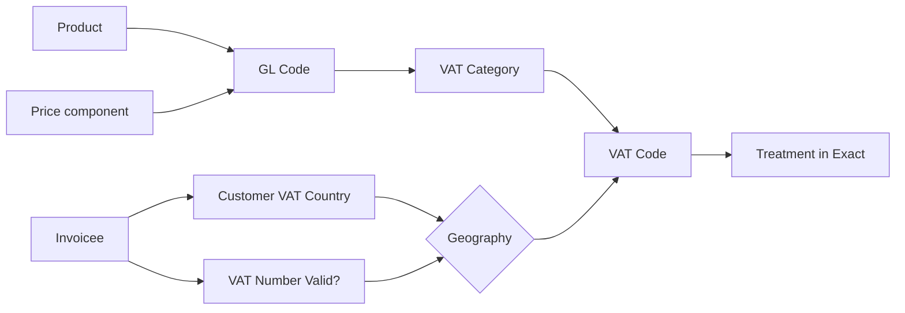

# VAT Code Scheme for C Teleport B.V.

*Aligned with BDO-approved VAT Manual (January 2026)*

---

## Core Logic

The VAT code is constructed from two inputs:

| Input | Source | Determines |
|-------|--------|------------|
| **Category** | GL Account | What type of service |
| **Geography** | Customer/Supplier Country | Where the customer is located |

The **Treatment** (21%, 0%, RC, OOS, EXM) is automatically derived from Category + Geography.

### Product × Price Component → VAT Category

The combination of Product and Price Component directly determines the VAT Category (the GL code is an intermediary that follows from this mapping):

| Product   | Price Component                                                  | Action points                                 | GL account              | VAT Category |
|:----------|:-----------------------------------------------------------------|:----------------------------------------------|:------------------------|:-------------|
| Flight    | ConvertedNet                                                     | To be renamed to match non flights            | 80001                   | PAS          |
| Flight    | Markup                                                           |                                               | 81001                   | FLT          |
| Flight    | High fare markup, marine markup, rebook                          | Decide if we need new GLs                     |                         |              |
| Flight    | Comission - not used for flights, only hotels ❌                  | ignore                                        | 81034, 80134            | FLT          |
| Flight    | Kickback / Cashback                                              |                                               | 1602                    | FLT          |
| Flight    | ConsolidatorMarkup                                               |                                               |                         | FLT          |
| Flight    | CompensationMarkup                                               |                                               | 8110                    | FLT          |
| Flight    | ClassDrop - calculated item 🧮                                    | ignore                                        | 8104                    | FLT          |
| Flight    | OperationalVariance - calculated item (failed ticketing etc.) 🧮 | ignore                                        | 7500                    | FLT          |
| Flight    | RebookDiffMarkup                                                 |                                               | 8111                    | FLT          |
| Flight    | RoundingMargin - positive only                                   |                                               | 8500                    | FLT          |
| Flight    | CurrencyMargin - hedging markup during sale                      |                                               | 8106                    | CUR          |
| Flight    | PaymentMethodFee - absent in Gherken ❌                           | add to Gherkin, add to GL CSV                 |                         |              |
| NonFlight | VendorPrice to be renamed                                        |                                               | 80002, 80003            | PAS          |
| NonFlight | Commission (RateHawk)                                            | move to Ratehawk from Customer, new agreement | ? new GL or reuse 81002 | NFT          |
| NonFlight | Markup                                                           |                                               | 81002, 81003            | NFT          |
| NonFlight | Kickback/Cashback - used only in flights ❌                       | put in TOP backlog                            |                         |              |
| NonFlight | RoundingMargin - only used in flights ❌                          | put in TOP backlog                            |                         |              |
| NonFlight | ConsolidatorMarkup (currently not used) ❌                        |                                               |                         | NFT          |
| NonFlight | CurrencyMargin                                                   | add to Gherkin                                | 8106                    | CUR          |
| NonFlight | PaymentMethodFee                                                 | add to Gherkin                                |                         | PAS          |

**NonFlight** includes: hotels, car rentals, trains, extra baggage, SaaS, platform fees, and all other non-flight services.

| VAT Category      | Code prefix | NL Treatment |
|:------------------|:------------|:-------------|
| Flight Margin     | F           | 0%           |
| Non-Flight Margin | N           | 21%          |
| Currency Margin   | CUR         | Exempt       |
| Pass-through      | PAS         | Out of Scope |

> **Note on hotel food/breakfast:** C Teleport acts as a disclosed agent (bemiddelaar) for hotel bookings. The entire hotel price — including accommodation (21%) and breakfast (9%) — is a pass-through (doorlopende post) and excluded from our taxable amount. The split between 21% accommodation and 9% food is the hotel's responsibility to apply. Our commission/markup on hotel bookings is always taxed at the standard 21% rate, as no reduced or zero rate exists for hotel intermediation. Therefore, no separate VAT category is needed for hotel food. See [VAT for hotels and ancillaries](../rules%20and%20laws/0%20vat%20for%20hotels%20and%20ancillaries.md) for full legal analysis.

---

## VAT Code Structure

VAT codes are exactly **3 characters**. For categories that vary by geography, the code is `[Category prefix][Geography suffix]`. Categories without geographic variation use a fixed 3-character code.

### Categories (from GL Code)

| Category          | Code prefix | Description                                          |
|:------------------|:------------|:-----------------------------------------------------|
| Flight Margin     | **F**       | Margins and markups on flights                       |
| Non-Flight Margin | **N**       | Hotels, trains, SaaS, platform, other service margin |
| Currency Margin   | **CUR**     | FX/currency markup (exempt financial service)        |
| Pass-through      | **PAS**     | Vendor price, COGS, payment fees - no margin         |
| Refunds           | **REF**     | Tax refunds                                          |
| Purchases         | **U**       | Costs/expenses                                       |

### Geographies (from Customer/Supplier Country)

| Suffix | Geography        | Description                                       |
|:-------|:-----------------|:--------------------------------------------------|
| **NL** | Netherlands      | Dutch customer/supplier                           |
| **EU** | EU (excl. NL)    | Non-NL EU customer/supplier with valid VAT number |
| **EX** | Non-NL EU no VAT | Non-NL EU customer without valid VAT number       |
| **XX** | Non-EU           | Customer/supplier outside EU                      |

---

## Treatment Derivation Matrix

Given Category + Geography, the Treatment is automatically determined:

| Category          | NL   | EU  | EX (EU no VAT) | XX  |
|:------------------|:-----|:----|:---------------|:----|
| Flight Margin     | 0    | 0   | 0              | OOS |
| Non-Flight Margin | 21   | RC  | 0              | OOS |
| Currency Margin   | EXM  | EXM | EXM            | EXM |
| Pass-through      | OOS  | OOS | OOS            | OOS |
| Refunds           | OOS  | OOS | OOS            | OOS |
| Purchases         | 21/9 | RC  | -              | RC  |

### Treatment Codes Explained

| Treatment | Meaning | VAT Return |
|-----------|---------|------------|
| **21** | 21% Dutch VAT charged | Box 1A |
| **0** | 0% zero-rated supply | Box 1E |
| **RC** | Reverse Charge to customer | Box 3B (sales) or 4A/4B (purchases) |
| **OOS** | Out of Scope - not reportable | Not reported |
| **EXM** | VAT Exempt (Article 135) | Not reported |

---

## Complete VAT Code List

### Revenue Codes

| VAT Code | Category          | Treatment | Box | ICP     | Invoice Text                                       |
|:---------|:------------------|:----------|:----|:--------|:---------------------------------------------------|
| FNL      | Flight Margin     | 0         | 1E  | No      | VAT 0% - intermediation int'l passenger transport  |
| FEU      | Flight Margin     | 0         | 1E  | No      | VAT 0% - intermediation int'l passenger transport  |
| FEX      | Flight Margin     | 0         | 1E  | No      | VAT 0% - intermediation int'l passenger transport  |
| FXX      | Flight Margin     | OOS       | -   | No      | *(none)*                                           |
| NNL      | Non-Flight Margin | 21        | 1A  | No      | VAT 21%                                            |
| NEU      | Non-Flight Margin | RC        | 3B  | **Yes** | Reverse charge - Article 196 Directive 2006/112/EC |
| NEX      | Non-Flight Margin | 0         | 1E  | No      | Reverse charge - Article 196 Directive 2006/112/EC |
| NXX      | Non-Flight Margin | OOS       | -   | No      | *(none)*                                           |
| CUR      | Currency Margin   | EXM       | -   | No      | VAT exempt - Article 135 Directive 2006/112/EC     |
| PAS      | Pass-through      | OOS       | -   | No      | Paid on behalf of your company                     |
| REF      | Refunds           | OOS       | -   | No      | *(none)*                                           |

**Note on NEX**: Invoice says "Reverse charge" but amount goes to Box 1E (not 3B) and is excluded from ICP. Per Dutch Tax Authority ruling (§6.2, Besluit administratieve verplichtingen omzetbelasting).

### Purchase Codes

| VAT Code | Category  | Treatment | Box     |
|:---------|:----------|:----------|:--------|
| UNL      | Purchases | 21 (or 9) | 5B     |
| UEU      | Purchases | RC        | 4B + 5B |
| UXX      | Purchases | RC        | 4A + 5B |

---

## GL Account → Category Mapping

### FLT (Flight Margin)

| GL Code      | GL Name                          | Price Component    |
|:-------------|:---------------------------------|:-------------------|
| 81001        | Markup                           | Markup             |
| 81034, 80134 | IATA Commission                  | Commission         |
| 1602         | Kickback / Cashback              | Kickback           |
| 8110         | Compensation markup              | CompensationMarkup |
| 8104         | Class drops                      | ClassDrop          |
| 7500         | Operational variance             | OperationalVariance|
| 8111         | Rebook diff markup               | RebookDiffMarkup   |
| 8500         | Rounding margin                  | RoundingMargin     |

### NFT (Non-Flight Margin)

| GL Code      | GL Name                          | Price Component    |
|:-------------|:---------------------------------|:-------------------|
| 81002, 81003 | Non-flight markup                | Markup             |
| ? / 81002    | Commission (RateHawk)            | Commission         |

### CUR (Currency Margin)

| GL Code | GL Name                          | Price Component    |
|:--------|:---------------------------------|:-------------------|
| 8106    | FX / currency margin             | CurrencyMargin     |

### PAS (Pass-through)

| GL Code      | GL Name                          | Price Component    |
|:-------------|:---------------------------------|:-------------------|
| 80001        | Flight vendor price              | ConvertedNet       |
| 80002, 80003 | Non-flight vendor price          | VendorPrice        |

### REF (Refunds)

| GL Code | GL Name    |
|:--------|:-----------|
| 8229    | Tax refund |

### PUR (Purchases)

| GL Code | GL Name                                   |
|:--------|:------------------------------------------|
| 4xxx    | All operating expenses                    |
| 7220    | Compensation of Intercompany expenses     |
| 7221    | Mark up on compensation Intercompany (LV) |

---

## VAT Return Box Mapping

| Box    | VAT Codes              |
|:-------|:-----------------------|
| **1A** | NNL                    |
| **1E** | FNL, FEU, FEX, NEX    |
| **3B** | NEU                    |
| **4A** | UXX                    |
| **4B** | UEU                    |
| **5B** | UNL, UEU, UXX         |

---

## ICP Report

**Filter**: VAT Code = `NEU`

**Validation**: Box 3B total = ICP total

