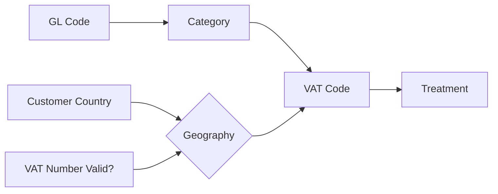

# VAT Code Scheme for C Teleport B.V.

*Aligned with BDO-approved VAT Manual (January 2026)*

---

## Core Logic

The VAT code is constructed from two inputs:

| Input | Source | Determines |
|-------|--------|------------|
| **Category** | GL Account | What type of service |
| **Geography** | Customer/Supplier Country | Where the customer is located |

The **Treatment** (21%, 0%, RC, OOS, EXM) is automatically derived from Category + Geography.

---

## VAT Code Structure

Format: `[Category]-[Geography]`

### Categories (from GL Code)

| Code | Category | Description |
|------|----------|-------------|
| **FLT** | Flights | Flight intermediation margin |
| **NFT** | Non-Flights | Hotels, trains, SaaS, platform, whitelabel margin |
| **FXE** | FX/Exempt | Currency/FX markup (exempt financial service) |
| **PAS** | Pass-through | GMV, COGS, CC fees - no margin |
| **REF** | Refunds | Tax refunds |
| **PUR** | Purchases | Costs/expenses |

### Geographies (from Customer/Supplier Country)

| Code | Geography | Description |
|------|-----------|-------------|
| **NL** | Netherlands | Dutch customer/supplier |
| **EU** | EU (excl. NL) | EU customer/supplier with valid VAT number |
| **EX** | EU no VAT | EU customer without valid VAT number |
| **XX** | Non-EU | Customer/supplier outside EU |

---

## Treatment Derivation Matrix

Given Category + Geography, the Treatment is automatically determined:

| Category | NL | EU | EX (EU no VAT) | XX |
|----------|-----|-----|----------------|-----|
| **FLT** | 0 | 0 | 0 | OOS |
| **NFT** | 21 | RC | 0 | OOS |
| **FXE** | EXM | EXM | EXM | EXM |
| **PAS** | OOS | OOS | OOS | OOS |
| **REF** | OOS | OOS | OOS | OOS |
| **PUR** | 21/9 | RC | - | RC |

### Treatment Codes Explained

| Treatment | Meaning | VAT Return |
|-----------|---------|------------|
| **21** | 21% Dutch VAT charged | Box 1A |
| **0** | 0% zero-rated supply | Box 1E |
| **RC** | Reverse Charge to customer | Box 3B (sales) or 4A/4B (purchases) |
| **OOS** | Out of Scope - not reportable | Not reported |
| **EXM** | VAT Exempt (Article 135) | Not reported |

---

## Complete VAT Code List

### Revenue Codes

| VAT Code | Treatment | Box | ICP | Invoice Text |
|----------|-----------|-----|-----|--------------|
| FLT-NL | 0 | 1E | No | VAT 0% - intermediation int'l passenger transport |
| FLT-EU | 0 | 1E | No | VAT 0% - intermediation int'l passenger transport |
| FLT-EX | 0 | 1E | No | VAT 0% - intermediation int'l passenger transport |
| FLT-XX | OOS | - | No | *(none)* |
| NFT-NL | 21 | 1A | No | VAT 21% |
| NFT-EU | RC | 3B | **Yes** | Reverse charge - Article 196 Directive 2006/112/EC |
| NFT-EX | RC | 1E | No | Reverse charge - Article 196 Directive 2006/112/EC |
| NFT-XX | OOS | - | No | *(none)* |
| FXE | EXM | - | No | VAT exempt - Article 135 Directive 2006/112/EC |
| PAS | OOS | - | No | Paid on behalf of your company |
| REF | OOS | - | No | *(none)* |

**Note on NFT-EX**: Invoice says "Reverse charge" but amount goes to Box 1E (not 3B) and is excluded from ICP. Per Dutch Tax Authority ruling (§6.2, Besluit administratieve verplichtingen omzetbelasting).

### Purchase Codes

| VAT Code | Treatment | Box |
|----------|-----------|-----|
| PUR-NL | 21 (or 9) | 5B |
| PUR-EU | RC | 4B + 5B |
| PUR-XX | RC | 4A + 5B |

---

## GL Account → Category Mapping

### FLT (Flights)

| GL Code | GL Name |
|---------|---------|
| 8100 | Markup Marine |
| 8101 | Markup Corporate |
| 8104 | Class drops Marine |
| 8105 | Class drops Corporate |
| 8107 | Consolidator markup |
| 8110 | GDS incentive compensation markup |
| 8020 | Airline incentives Intercompany |
| 8021 | GDS incentives |
| 80134 | IATA Commission TKTT NL |
| 81134 | IATA Commission TKTT LV |

### NFT (Non-Flights)

| GL Code | GL Name |
|---------|---------|
| 8206 | Commission Hotels (online) |
| 8205 | Commissions ancillary services |
| 8202 | Mark up ancillary services NL |
| 8212 | Mark up ancillary services EU |
| 8222 | Mark up ancillary services outside EU |
| 8225 | Extra baggage |
| 8010 | Turnover SaaS One off |
| 8011 | Turnover SaaS monthly |
| 8090 | Platform subscription fee |
| 8091 | Minimum booking fee |

### FXE (FX/Exempt)

| GL Code | GL Name |
|---------|---------|
| 8106 | FX markup |
| 8203 | FX markup ancillary |
| 8213 | FX markup ancillary services EU |
| 8223 | FX markup ancillary services outside EU |

### PAS (Pass-through)

| GL Code | GL Name |
|---------|---------|
| 8102 | Turnover Tickets Marine |
| 8103 | Turnover Tickets Corporate |
| 8115 | Turnover hotels |
| 8201 | Turnover ancillary services NL |
| 8211 | Turnover ancillary services EU |
| 8221 | Turnover ancillary services outside EU |
| 7211 | Cost of Goods Turnover (0%) |
| 72114-72149 | COGS IATA accounts |
| 8108 | Amex Credit card costs |
| 8112-8114 | Ecommpay fees |
| 7212 | Consolidator fees costs |

### REF (Refunds)

| GL Code | GL Name |
|---------|---------|
| 8229 | Tax refund |

### PUR (Purchases)

| GL Code | GL Name |
|---------|---------|
| 4xxx | All operating expenses |
| 7220 | Compensation of Intercompany expenses |
| 7221 | Mark up on compensation Intercompany (LV) |

---

## VAT Return Box Mapping

| Box | VAT Codes |
|-----|-----------|
| **1A** | NFT-NL |
| **1E** | FLT-NL, FLT-EU, FLT-EX, NFT-EX |
| **3B** | NFT-EU |
| **4A** | PUR-XX |
| **4B** | PUR-EU |
| **5B** | PUR-NL, PUR-EU, PUR-XX |

---

## ICP Report

**Filter**: VAT Code = `NFT-EU`

**Validation**: Box 3B total = ICP total
